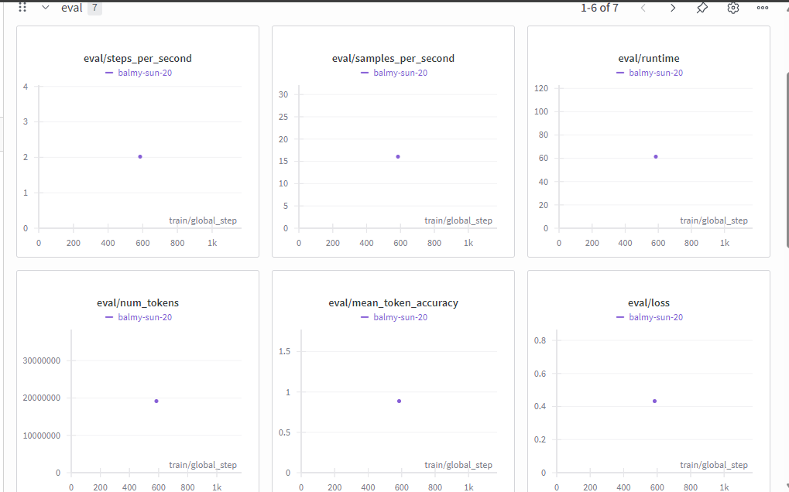
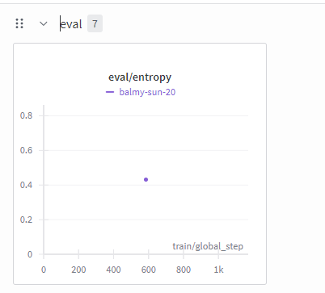
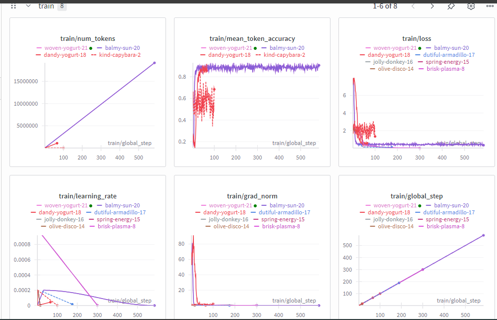
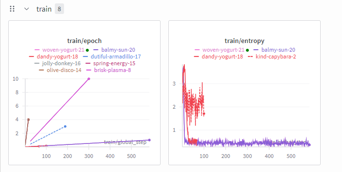
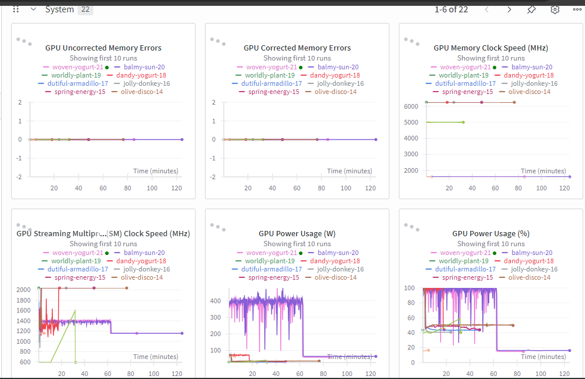
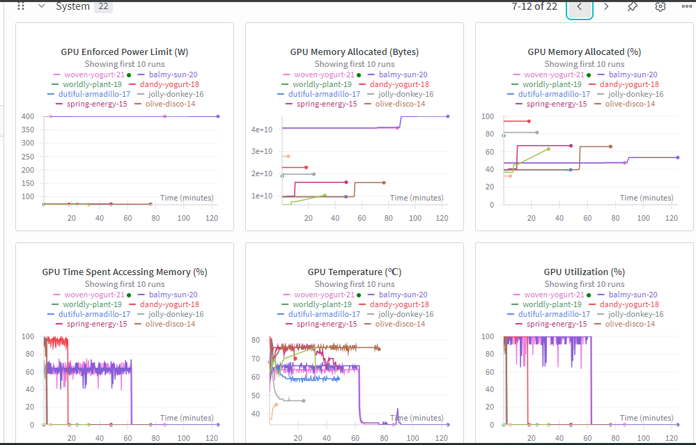
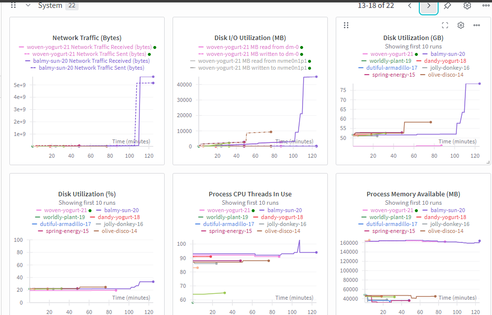
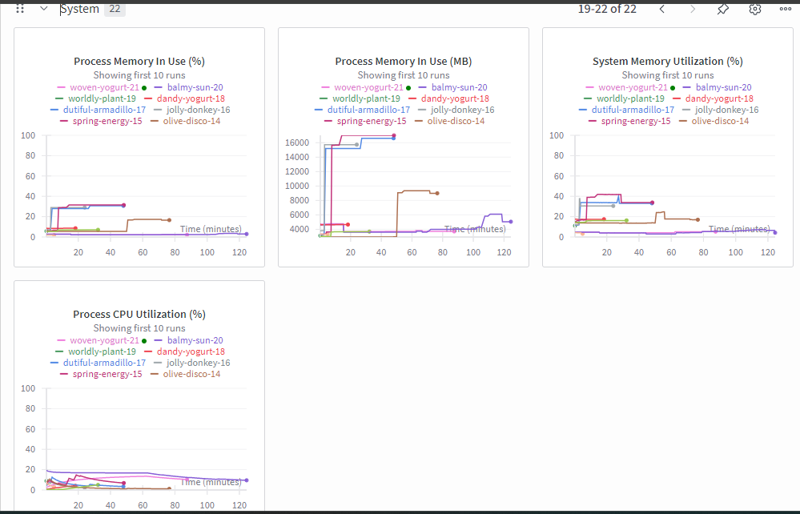

# 🧠Fine-Tuned Medical Assistant LLM API

An intelligent **Medical Assistant** powered by fine-tuning **Large Language Model (LLM)** that helps users answer medical-related questions with **reasoning-based explanations**.  
[The Med-Assistant LLM](https://huggingface.co/diyorarti/med-mixed-merged) is fine-tuned on the [dataset](https://huggingface.co/datasets/FreedomIntelligence/medical-o1-reasoning-SFT) and deployed as [a production-ready API](https://medical-assistant-c3n1.onrender.com) on Render.

---

## 🚀 Project Overview

This project aims to build a reliable **medical question & answerin through reasoning-based explanations** using a fine-tuned version of **Qwen/Qwen2.5-3B-Instruct**. The model provides **chain-of-thought** reasoning for complex medical queries, offering users both clear answers and transparent reasoning when applicable.

### **Training Objective:**  
A **mixed approach**:
- 70% of the training data contains **only the final answer**
- 30% includes **reasoning + final answer**

This combination helps the model balance concise answers with deeper reasoning capability.

---

## 🧩 Tech Stack

| Area | Tools / Libraries |
|------|--------------------|
| Model Fine-tuning | Hugging Face Transformers |
| Fine-tuning Method | LoRA (via PEFT) |
| Logging & Tracking | TensorBoard, Weights & Biases (wandb) |
| Environment | Google Colab (GPU) |
| API Development | FastAPI |
| Containerization | Docker |
| Deployment | Render (for API), Hugging Face Hub (for model) |

---

## 🧠 Model Details

- **Base model:** [Qwen/Qwen2.5-3B-Instruct](https://huggingface.co/Qwen/Qwen2.5-3B-Instruct)  
- **Fine-tuned dataset:** [FreedomIntelligence/medical-o1-reasoning-SFT](https://huggingface.co/datasets/FreedomIntelligence/medical-o1-reasoning-SFT)  
- **Fine-tuned model:** [diyorarti/med-mixed-merged](https://huggingface.co/diyorarti/med-mixed-merged)
---

---

## 📊 Model Performance & Evaluation

The fine-tuned **Medical Assistant LLM** was trained and evaluated using **Weights & Biases (wandb)**.  
The following visualizations summarize the model’s **evaluation metrics**, **training dynamics**, and **system performance**.

---

### ⚙️ Training Configuration

| Parameter | Value |
|------------|--------|
| **Base Model** | Qwen/Qwen2.5-3B-Instruct |
| **Dataset** | FreedomIntelligence/medical-o1-reasoning-SFT |
| **Fine-tuning Method** | LoRA (via PEFT) |
| **Epochs** | 1 |
| **Batch Size (per device)** | 8 |
| **Gradient Accumulation Steps** | 4 |
| **Learning Rate** | 2e-4 |
| **Warmup Ratio** | 0.05 |
| **Scheduler** | Cosine |
| **Mixed Precision** | bf16 |
| **Optimizer** | AdamW |
| **Reporting Tool** | wandb.ai  |

---

### 📈 Evaluation Metrics

| Metric | Visualization |
|---------|----------------|
| **Eva** |  |
| **Eval** |  |

> Evaluation plots monitor the model’s performance during validation — including processing speed (steps/s, samples/s), accuracy, loss, and entropy — to assess both efficiency and generalization quality during inference.

---

### 🧩 Training Dynamics

| Metric | Visualization |
|---------|----------------|
| **Train** |  |
| **Train** |  |

> Training plots display the model’s learning progress across steps and epochs — including loss reduction, accuracy improvement, gradient stability, and learning rate decay. The consistent downward trend in loss and steady accuracy curve confirm effective fine-tuning and convergence.

---

### ⚙️ System Performance

| Metric | Visualization |
|---------|----------------|
| **GPU Utilization & Temperature** |  |
| **GPU Power Usage** |  |
| **CPU & Memory Usage** |  |
| **Overall Runtime Stability** |  |

> The system monitoring plots track GPU and CPU resource utilization throughout training. They help ensure stable hardware performance and efficient computation during fine-tuning.

---

### 🧠 Insights

- The **training loss** consistently declined, accompanied by a steady rise in **mean token accuracy**, indicating effective learning and parameter optimization.  
- **Evaluation throughput** (steps and samples per second) remained stable across validation runs, confirming consistent inference efficiency.  
- **System utilization metrics** (**GPU**, **CPU**, and **memory**) showed balanced resource consumption without thermal or performance bottlenecks.  
- The model reached **stable convergence within a single epoch**, demonstrating strong fine-tuning efficiency and well-chosen hyperparameters.  

---

### 🧭 Access the Full Dashboard

You can view the full experiment logs, metrics, and visualizations here:

🔗 [**Weights & Biases Dashboard → diyor/huggingface**](https://wandb.ai/diyor/huggingface)

---


## 🔄 How the API Works

The Medical Assistant API connects a FastAPI backend with a fine-tuned Large Language Model (LLM) hosted on Hugging Face.

1. **User sends a request** → A client (like `curl`, Postman, or frontend app) sends a POST request to the `/v1/generate` or `/v1/chat/completions` endpoint with a medical query.
2. **API processes the input** → FastAPI receives the request and forwards the prompt to the Hugging Face Inference Endpoint using `HF_API_TOKEN` AND `HF_Endpoint_Url`.
3. **Model reasoning** → The fine-tuned model (`diyorarti/med-mixed-merged`) generates both reasoning steps and the final medical answer.
4. **Response returned** → The API formats the model’s output into JSON and sends it back to the user for display or further use.

📘 Example request:
```bash
# request for generate endpoint
curl -X 'POST' \
  'https://medical-assistant-c3n1.onrender.com/v1/generate' \
  -H 'Content-Type: application/json' \
  -d '{
  "prompt": "Given the symptoms of sudden weakness in the left arm and leg",
  "max_new_tokens": 128,
  "temperature": 0.7,
  "top_p": 0.9
}'
# llm answer 
{
  "output_text": "Based on the symptoms of sudden weakness in the left arm and leg, recent long-distance travel, and the presence of swollen and tender right lower leg, it's important to consider potential issues that could arise from these factors. One possible cardiac abnormality to consider is deep vein thrombosis (DVT), which is a condition where a blood clot forms in the deep veins of the leg. This can cause swelling, tenderness, and even pain in the leg. The sudden weakness in the left arm and leg could be due to a stroke or transient ischemic attack (TIA), possibly related to reduced blood flow if there is a clot."
}

# request for chat/completion endpoint
curl -X 'POST' \
  'https://medical-assistant-c3n1.onrender.com/v1/chat/completions' \
  -H 'Content-Type: application/json' \
  -d '{
  "model": "your-model",
  "messages": [
    {
      "role": "user",
      "content": "Given the symptoms of sudden weakness in the left arm and leg"
    }
  ],
  "max_tokens": 256,
  "temperature": 0.7,
  "top_p": 0.9
}'
# llm answer 
{
  "id": "chatcmpl-1",
  "object": "chat.completion",
  "model": "your-model",
  "choices": [
    {
      "index": 0,
      "finish_reason": "stop",
      "message": {
        "role": "assistant",
        "content": "Reasoning (brief): Okay, let's think about this. The symptoms are pretty specific. There's sudden weakness on the left side of the body, which is the kind of thing you'd expect with a stroke. And then there's the swollen and tender right leg. Hmm, that definitely makes me think of deep vein thrombosis, or DVT. Now, why DVT? Well, it's not every day that you get a stroke and a swollen leg at the same time, so there must be some connection.\n\nNow, what could cause both of these? Could it be something related to the heart? Let's see, DVT is often linked to heart issues, especially with the heart's ability to pump blood effectively. There's something called atrial fibrillation, and that's known to cause clotting issues, which could lead to DVT. But wait, could there be more to it? I mean, atrial fibrillation is pretty common, but it's not the only heart abnormality that might cause these symptoms. There's also something called mitral stenosis. That's when the mitral valve is narrowed, and it can lead to heart failure and clot formation, which could cause strokes and DVTs."
      }
    }
  ]
}
```

## ⚙️ API Endpoints

| Method | Endpoint | Description |
|--------|-----------|-------------|
| `GET` | `/` | Home |
| `GET` | `/health` | Health check |
| `POST` | `/v1/generate` | Generate model output |
| `POST` | `/v1/chat/completions` | Chat completion endpoint |
---

## 🐳 Deployment

1. Fine-tuned model uploaded to Hugging Face Hub  
   🔗 [Model Link](https://huggingface.co/diyorarti/med-mixed-merged)

2. Model hosted on Hugging Face Inference Endpoints  
   🔗 [Inference Endpoint]() I can't share the endpoint URL due to security reasons. 

3. Production API developed using **FastAPI** and **Docker**, deployed to **Render**  
   🔗 [Live API](https://medical-assistant-c3n1.onrender.com) now, I have paused LLM. 

---

## 📸 API Screenshot


---


## 🧰 Installation & Setup (for local run)

```bash
# Clone the repository
git clone https://github.com/diyorarti/Medical-assistant.git
cd Medical-assistant

# Build Docker image
docker build -t medical-llm-api:latest .

# Run container
docker run --rm -p 8000:8000 -e HF_API_TOKEN=hf_******************************** -e API_KEY=****** medical-llm-api:latest
```

### NOTE
I have Paused HF-Endpoint, API generates when HF-Endpoint is on