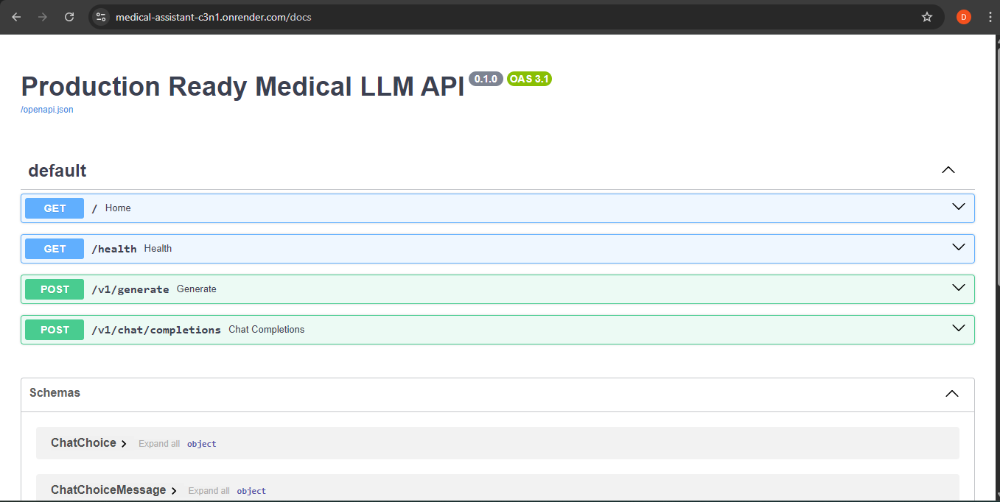
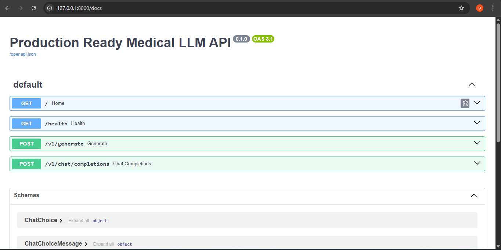
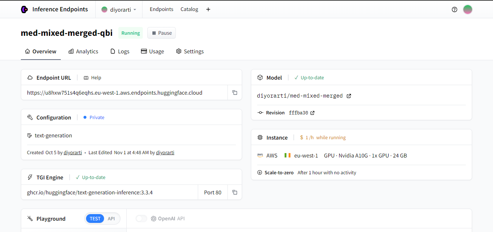
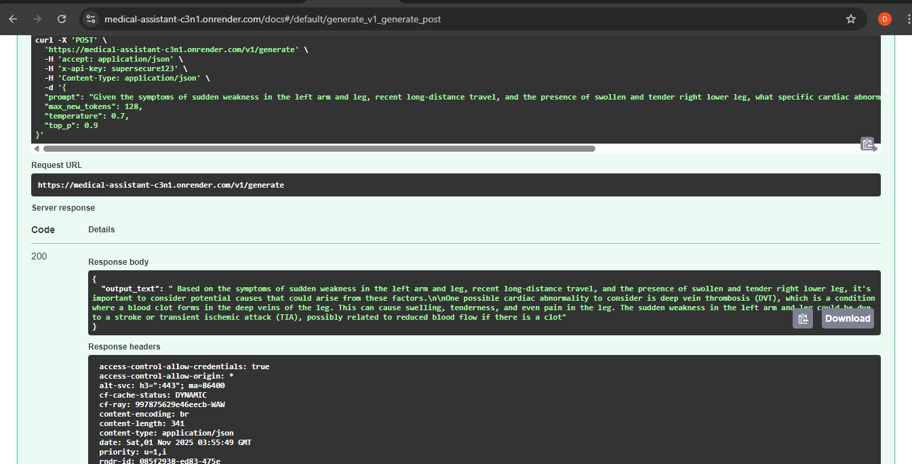

# 🧠 Medical Assistant API

An intelligent **Medical Assistant** powered by a fine-tuned **Large Language Model (LLM)** that helps users answer medical-related questions with **reasoning-based explanations**.  
[The Med-Assistant](https://huggingface.co/diyorarti/med-mixed-merged) is fine-tuned on the [*FreedomIntelligence/medical-o1-reasoning-SFT*](https://huggingface.co/datasets/FreedomIntelligence/medical-o1-reasoning-SFT) dataset and deployed as [a production-ready API](https://medical-assistant-c3n1.onrender.com).

---

## 🚀 Project Overview

This project aims to build a reliable **medical question-answering system** using a fine-tuned version of **Qwen/Qwen2.5-3B-Instruct**.  
The model provides **chain-of-thought** reasoning for complex medical queries, offering users both clear answers and transparent reasoning when applicable.

**Training Objective:**  
A **mixed approach**:
- 70% of the training data contains **only the final answer**
- 30% includes **reasoning + final answer**

This combination helps the model balance concise answers with deeper reasoning capability.

---

## 🧩 Tech Stack

| Area | Tools / Libraries |
|------|--------------------|
| Model Fine-tuning | Hugging Face Transformers |
| Fine-tuning Method | LoRA (via PEFT) |
| Logging & Tracking | TensorBoard, Weights & Biases (wandb) |
| Environment | Google Colab (GPU) |
| API Development | FastAPI |
| Containerization | Docker |
| Deployment | Render (for API), Hugging Face Hub (for model) |

---

## 🧠 Model Details

- **Base model:** [Qwen/Qwen2.5-3B-Instruct](https://huggingface.co/Qwen/Qwen2.5-3B-Instruct)  
- **Fine-tuned dataset:** [FreedomIntelligence/medical-o1-reasoning-SFT](https://huggingface.co/datasets/FreedomIntelligence/medical-o1-reasoning-SFT)  
- **Fine-tuned model:** [diyorarti/med-mixed-merged](https://huggingface.co/diyorarti/med-mixed-merged)

Model is hosted on **Hugging Face Inference Endpoints** for real-time responses.

---

## ⚙️ API Endpoints

| Method | Endpoint | Description |
|--------|-----------|-------------|
| `GET` | `/` | Home |
| `GET` | `/health` | Health check |
| `POST` | `/v1/generate` | Generate model output |
| `POST` | `/v1/chat/completions` | Chat completion endpoint |

📘 **Swagger Documentation:**  
👉 [View API Docs](https://medical-assistant-c3n1.onrender.com/docs)

---

## 🐳 Deployment

1. Fine-tuned model uploaded to Hugging Face Hub  
   🔗 [Model Link](https://huggingface.co/diyorarti/med-mixed-merged)

2. Model hosted on Hugging Face Inference Endpoints  
   🔗 [Inference Endpoint]()

3. Production API developed using **FastAPI** and **Docker**, deployed to **Render**  
   🔗 [Live API](https://medical-assistant-c3n1.onrender.com)

---

## 📸 Screenshot







---


## 🧰 Installation & Setup (for local run)

```bash
# Clone the repository
git clone https://github.com/diyorarti/Medical-assistant.git
cd Medical-assistant

# Build Docker image
```bash
docker build -t medical-llm-api:latest .
```

# Run container
```bash
docker run --rm -p 8000:8000 -e HF_API_TOKEN=hf_******************************** -e API_KEY=****** medical-llm-api:latest
```

